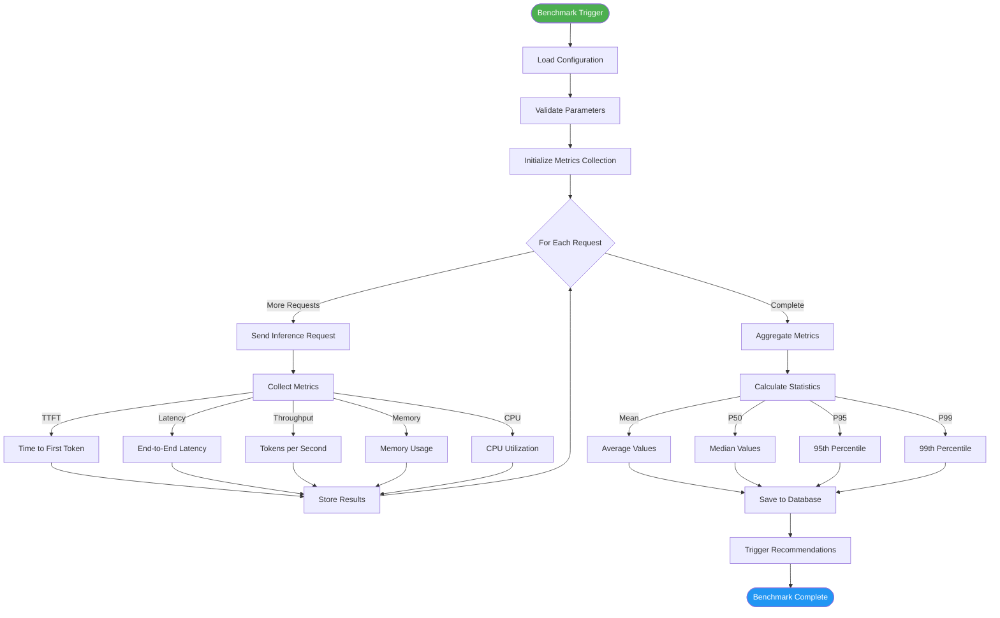
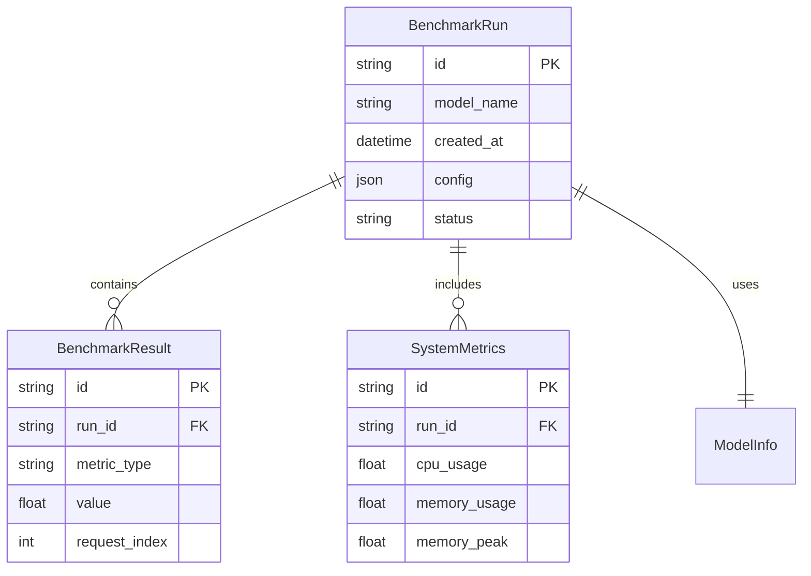

# Benchmark Pipeline Flow

Detailed flow of how benchmarks are executed and results collected.



## Benchmark Metrics

### Latency Metrics

| Metric | Description | Target |
|--------|-------------|--------|
| TTFT | Time to first token | < 100ms |
| Latency (P50) | Median response time | < 500ms |
| Latency (P95) | 95th percentile | < 1000ms |
| Latency (P99) | 99th percentile | < 2000ms |

### Throughput Metrics

| Metric | Description | Target |
|--------|-------------|--------|
| Tokens/sec | Generation speed | > 50 tokens/sec |
| Requests/sec | Concurrent handling | > 10 req/sec |
| Batch efficiency | Batch vs sequential | > 80% |

### Resource Metrics

| Metric | Description | Target |
|--------|-------------|--------|
| CPU Usage | Processor utilization | < 90% |
| Memory Usage | RAM consumption | < 80% |
| Memory Peak | Maximum memory | < 90% |

## Benchmark Configuration

```yaml
benchmark:
  model: "llama-3.2-3b"
  threads: 8
  batch_size: 512
  num_requests: 10
  max_tokens: 128
  context_length: 2048
  warmup_runs: 3
  timeout: 30
```

## Results Storage



## Benchmark Scenarios

| Scenario | Description | Use Case |
|----------|-------------|----------|
| Latency | Single request response time | Interactive chat |
| Throughput | Concurrent request handling | Production load |
| Memory | Memory usage under load | Resource planning |
| Endurance | Long-running stability | Production readiness |
