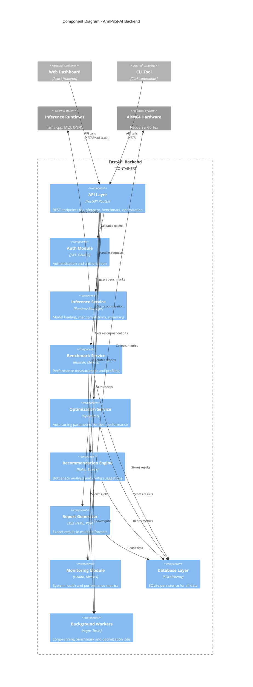

# Component Diagram

Detailed view of the backend API server internals.

## Components

| Component | Responsibility | Key Files |
|-----------|---------------|-----------|
| API Layer | REST endpoints | `backend/app/api/` |
| Auth Module | JWT/OAuth2 authentication | `backend/app/auth/` |
| Inference Service | Model loading and inference | `backend/app/inference/` |
| Benchmark Service | Performance measurement | `backend/app/benchmark/` |
| Optimization Service | Auto-tuning parameters | `backend/app/optimization/` |
| Recommendation Engine | Bottleneck analysis | `backend/app/recommendation/` |
| Report Generator | Export results | `backend/app/reports/` |
| Monitoring Module | Health and metrics | `backend/app/monitoring/` |
| Database Layer | SQLite persistence | `backend/app/database/` |
| Background Workers | Async task execution | `backend/app/workers/` |

## Interactions

1. **Request Flow** — API Layer routes to appropriate service
2. **Authentication** — Auth Module validates JWT tokens
3. **Inference** — Service loads models via runtime backends
4. **Benchmarking** — Workers execute long-running jobs
5. **Optimization** — Workers explore parameter space
6. **Recommendation** — Engine analyzes metrics and applies rules
7. **Reporting** — Generator creates formatted output
