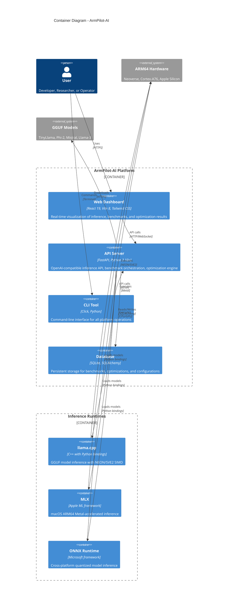

# Container Diagram

Shows the high-level technical building blocks and their interactions.

## Containers

| Container | Technology | Purpose |
|-----------|------------|---------|
| Web Dashboard | React 19, Vite 8, Tailwind CSS | Real-time visualization |
| API Server | FastAPI, Python 3.10+ | Core business logic |
| CLI Tool | Click, Python | Command-line interface |
| Database | SQLite, SQLAlchemy | Persistent storage |

## Inference Runtimes

| Runtime | Platform | Model Format | Acceleration |
|---------|----------|--------------|--------------|
| llama.cpp | All (ARM64 native) | GGUF | NEON/SVE2 SIMD |
| MLX | macOS ARM64 | GGUF, Safetensors | Metal GPU |
| ONNX Runtime | Cross-platform | ONNX | CPU/GPU |

## Data Flow

1. **User → Frontend/CLI** — HTTP/CLI requests
2. **Frontend/CLI → Backend** — API calls
3. **Backend → Database** — Persistence
4. **Backend → Runtimes** — Model loading and inference
5. **Runtimes → Hardware** — Optimized execution
