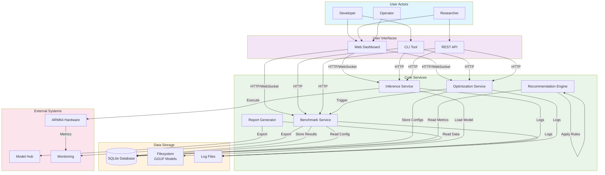

# Data Flow Diagram

Shows how data moves through the ArmPilot-AI system.

## Data Flows

### Inference Flow

1. User sends chat completion request
2. API validates request schema
3. Inference Service loads model (if not loaded)
4. Model executes on ARM64 hardware
5. Response streamed back to user
6. Request logged to database

### Benchmark Flow

1. User triggers benchmark run
2. Benchmark Service reads configuration
3. Runner sends N requests to Inference Service
4. Metrics collected (latency, throughput, memory)
5. Results stored in database
6. Recommendations triggered

### Optimization Flow

1. User starts optimization sweep
2. Optimization Service generates candidate configs
3. For each candidate:
   - Config applied to Inference Service
   - Benchmark executed
   - Results recorded
4. Best config identified and saved
5. Recommendations generated

### Report Flow

1. User requests report generation
2. Report Generator reads benchmark/optimization data
3. Data formatted as Markdown/HTML/PDF
4. Report exported to filesystem or external system

## Data Models

| Entity | Description | Storage |
|--------|-------------|---------|
| BenchmarkRun | Complete benchmark execution | SQLite |
| BenchmarkResult | Individual metric result | SQLite |
| OptimizationSweep | Optimization experiment | SQLite |
| OptimizationCandidate | Parameter configuration | SQLite |
| Recommendation | AI-generated suggestion | SQLite |
| ModelInfo | GGUF model metadata | Filesystem |
| SystemProfile | Hardware configuration | SQLite |
