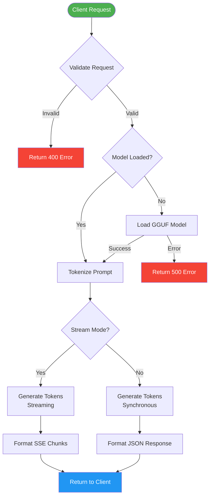
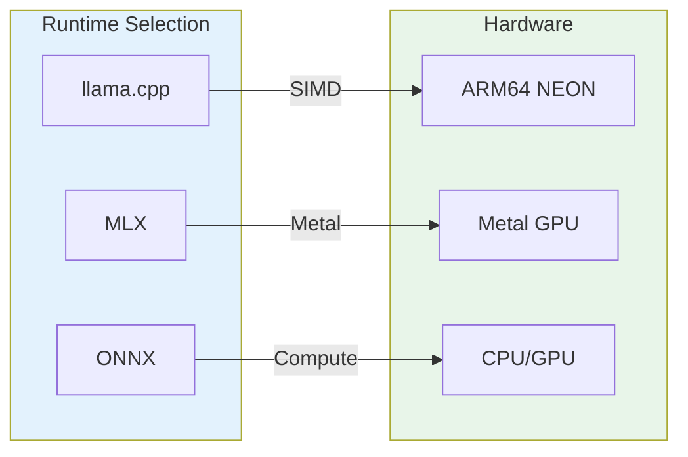

# Inference Pipeline Flow

Detailed flow of how inference requests are processed.



## Detailed Steps

### 1. Request Validation

```python
# Pydantic schema validation
ChatCompletionRequest(
    model: str,
    messages: List[Message],
    max_tokens: int = 256,
    temperature: float = 0.7,
    stream: bool = False
)
```

### 2. Model Loading

```python
# Runtime manager loads model
def load_model(model_id, n_threads, n_ctx, n_batch):
    # 1. Locate GGUF file
    # 2. Create Llama instance
    # 3. Set thread affinity
    # 4. Store in runtime manager
    # 5. Update model status
```

### 3. Token Generation

| Mode | Method | Output |
|------|--------|--------|
| Sync | `llama.create_completion()` | JSON response |
| Stream | `llama.create_completion(stream=True)` | SSE chunks |

### 4. Streaming Protocol

```
data: {"id":"chatcmpl-123","object":"chat.completion.chunk","choices":[{"delta":{"content":"Hello"}}]}

data: {"id":"chatcmpl-123","object":"chat.completion.chunk","choices":[{"delta":{"content":" world"}}]}

data: [DONE]
```

## Runtime Backends



## Performance Optimizations

| Optimization | Description | Impact |
|--------------|-------------|--------|
| Thread Pinning | Bind threads to physical cores | +15% throughput |
| Memory Mapping | mmap GGUF files | -50% load time |
| KV Cache | Quantized cache (Q8_0) | -30% memory |
| Batch Processing | Parallel token generation | +20% throughput |
