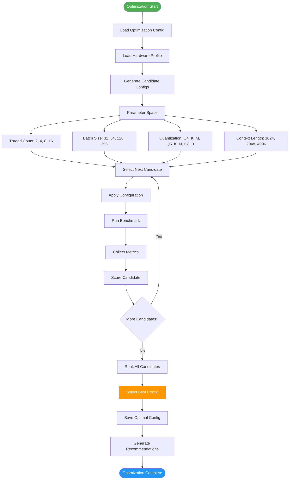
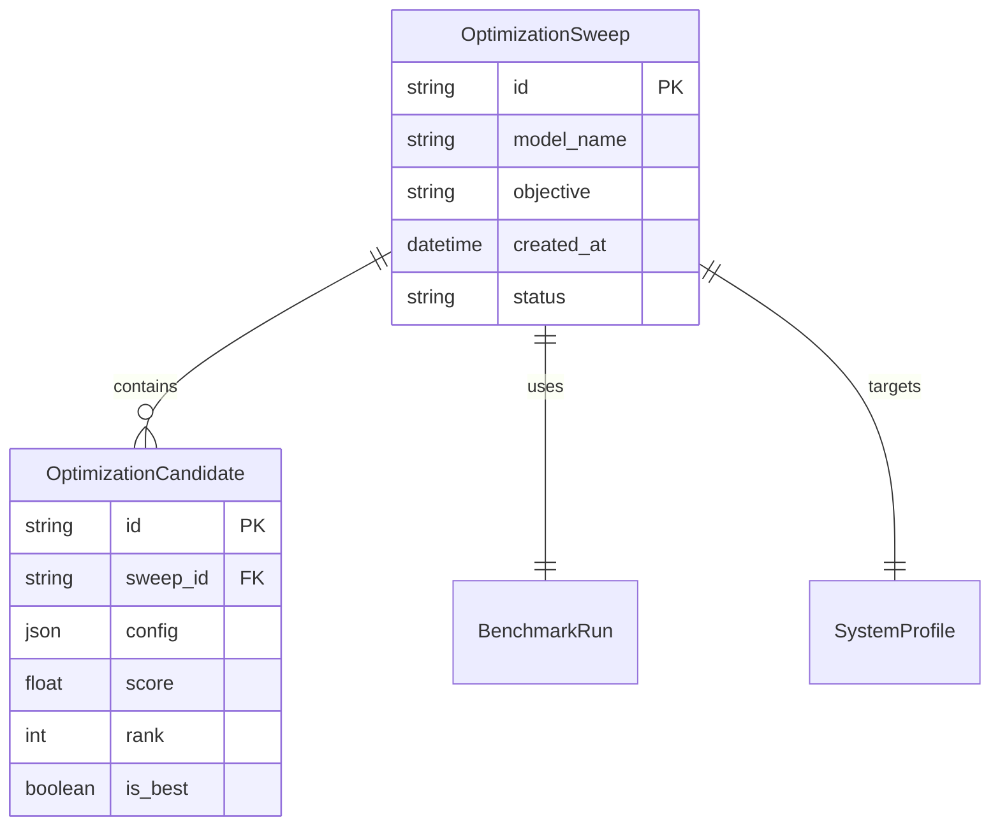

# Optimization Pipeline Flow

Detailed flow of how optimization sweeps are executed.



## Optimization Objectives

| Objective | Description | Trade-off |
|-----------|-------------|-----------|
| Latency | Minimize response time | Lower throughput |
| Throughput | Maximize tokens/sec | Higher latency |
| Memory | Minimize RAM usage | Lower performance |
| Balanced | Optimize all metrics | Middle ground |

## Parameter Search Space

### Thread Count

| Threads | Effect | Best For |
|---------|--------|----------|
| 2 | Low CPU usage | Edge devices |
| 4 | Balanced | Mobile |
| 8 | Good performance | Desktop |
| 16 | High performance | Server |
| 32+ | Maximum | Neoverse |

### Batch Size

| Batch | Effect | Best For |
|-------|--------|----------|
| 32 | Low memory | Constrained |
| 64 | Balanced | General |
| 128 | Good throughput | Production |
| 256 | High throughput | High-load |
| 512+ | Maximum | Neoverse |

### Quantization

| Format | Size | Speed | Quality |
|--------|------|-------|---------|
| Q4_K_M | Smallest | Fastest | Good |
| Q5_K_M | Small | Fast | Better |
| Q8_0 | Large | Slow | Best |

## Scoring Algorithm

```python
def score_candidate(candidate, objective):
    if objective == "latency":
        return candidate.latency_p50 * 0.5 + candidate.latency_p95 * 0.3 + candidate.ttft * 0.2
    elif objective == "throughput":
        return candidate.tokens_per_sec * 0.6 + candidate.requests_per_sec * 0.4
    elif objective == "memory":
        return candidate.memory_usage * 0.7 + candidate.memory_peak * 0.3
    else:  # balanced
        return (
            candidate.latency_score * 0.3 +
            candidate.throughput_score * 0.3 +
            candidate.memory_score * 0.2 +
            candidate.cpu_score * 0.2
        )
```

## Optimization Results



## Optimization Strategies

| Strategy | Description | Speed | Accuracy |
|----------|-------------|-------|----------|
| Grid Search | Exhaustive parameter grid | Slow | High |
| Random Search | Random parameter sampling | Fast | Medium |
| Bayesian | Model-based optimization | Medium | High |
| Heuristic | Rule-based exploration | Fast | Medium |

## Hardware Profiles

### Cortex-A76

```yaml
profile: cortex-a76
max_threads: 8
batch_sizes: [4, 8, 16]
quantizations: [Q4_K_M, Q5_K_M, Q8_0]
context_lengths: [512, 1024, 2048]
```

### Neoverse N1

```yaml
profile: neoverse-n1
max_threads: 64
batch_sizes: [8, 16, 32, 64]
quantizations: [Q4_K_M, Q5_K_M]
context_lengths: [1024, 2048, 4096]
```

### Neoverse V2

```yaml
profile: neoverse-v2
max_threads: 64
batch_sizes: [16, 32, 64, 128]
quantizations: [Q4_K_M, Q5_K_M, Q8_0]
context_lengths: [2048, 4096, 8192]
```
