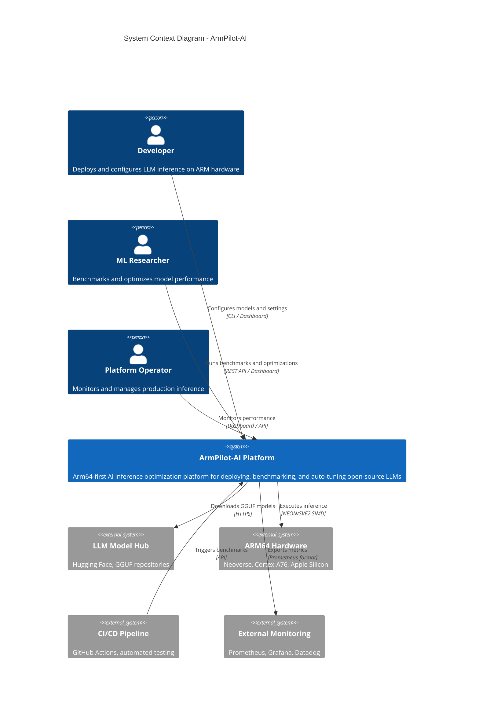

# System Context Diagram

High-level view showing ArmPilot-AI's position in the ecosystem and its interactions with external actors.

## Actors

| Actor | Role | Interface |
|-------|------|-----------|
| Developer | Deploys and configures LLM inference | CLI, Dashboard |
| ML Researcher | Benchmarks and optimizes model performance | REST API, Dashboard |
| Platform Operator | Monitors and manages production inference | Dashboard, API |

## External Systems

| System | Purpose | Integration |
|--------|---------|-------------|
| LLM Model Hub | Source for GGUF model files | HTTPS download |
| ARM64 Hardware | Target inference platform | NEON/SVE2 SIMD |
| CI/CD Pipeline | Automated testing and deployment | API triggers |
| External Monitoring | Observability stack | Prometheus metrics |

## Key Interactions

1. **Model Acquisition** — Platform downloads GGUF models from external repositories
2. **Inference Execution** — Direct hardware access for optimized ARM64 inference
3. **Metrics Export** — Prometheus-compatible metrics for external monitoring
4. **CI/CD Integration** — API-driven benchmark triggers for automated testing
